# ☁️ AWS Cloud Resume Challenge


> A serverless cloud resume website built with AWS services, featuring a dynamic visitor counter and fully automated infrastructure deployment using Terraform.

**🔗 Live Demo:** [https://d150bm922en909.cloudfront.net](https://d150bm922en909.cloudfront.net)

---

## 📋 Table of Contents

- [Overview](#overview)
- [Architecture](#architecture)
- [AWS Services Used](#aws-services-used)
- [Features](#features)
- [Infrastructure as Code](#infrastructure-as-code)
- [Project Structure](#project-structure)
- [Deployment](#deployment)
- [Cost Breakdown](#cost-breakdown)
- [Challenges & Solutions](#challenges--solutions)
- [What I Learned](#what-i-learned)
- [Future Improvements](#future-improvements)

---

## 🎯 Overview

This project is my implementation of the [Cloud Resume Challenge](https://cloudresumechallenge.dev/), demonstrating hands-on experience with AWS cloud services, Infrastructure as Code (IaC), serverless architecture, and modern web development practices.

**Key Highlights:**
- ✅ **Serverless Architecture** - No servers to manage, fully scalable
- ✅ **Infrastructure as Code** - 100% Terraform, reproducible infrastructure
- ✅ **Cost Optimized** - Runs within AWS Free Tier (~$0/month)
- ✅ **Production Ready** - HTTPS, CDN, monitoring, error handling
- ✅ **API Gateway Integration** - RESTful API for visitor counter

---

## 🏗️ Architecture

```mermaid
graph TB
    User[👤 User Browser]
    
    subgraph "AWS Cloud"
        subgraph "Content Delivery"
            CF[☁️ CloudFront<br/>CDN Distribution]
            S3[📦 S3 Bucket<br/>Static Website]
        end
        
        subgraph "API Layer"
            APIGW[🚪 API Gateway<br/>REST API]
        end
        
        subgraph "Compute Layer"
            Lambda[⚡ Lambda Function<br/>Python 3.9]
        end
        
        subgraph "Data Layer"
            DDB[(🗄️ DynamoDB<br/>Visitor Count)]
        end
        
        subgraph "Monitoring"
            CW[📊 CloudWatch<br/>Logs & Metrics]
        end
    end
    
    User -->|HTTPS Request| CF
    CF -->|Fetch HTML/CSS/JS| S3
    User -->|API Call| APIGW
    APIGW -->|Invoke| Lambda
    Lambda -->|Read/Write| DDB
    Lambda -->|Logs| CW
    APIGW -->|Logs| CW
    
    style CF fill:#FF9900
    style S3 fill:#569A31
    style APIGW fill:#FF4F8B
    style Lambda fill:#FF9900
    style DDB fill:#4053D6
    style CW fill:#FF4F8B
```



### **Architecture Flow:**

1. **User visits website** → CloudFront serves cached content from S3
2. **JavaScript executes** → Calls API Gateway endpoint
3. **API Gateway** → Triggers Lambda function
4. **Lambda function** → Increments visitor count in DynamoDB
5. **Response** → Returns updated count to user
6. **Monitoring** → All logs sent to CloudWatch

---

## 🛠️ AWS Services Used

| Service | Purpose | Configuration |
|---------|---------|---------------|
| **S3** | Static website hosting | Public read via CloudFront OAC |
| **CloudFront** | CDN for global content delivery | HTTPS, caching, custom error pages |
| **API Gateway** | RESTful API endpoint | CORS enabled, regional endpoint |
| **Lambda** | Serverless compute for visitor counter | Python 3.9, 128MB memory |
| **DynamoDB** | NoSQL database for visitor count | On-demand billing, single table |
| **CloudWatch** | Logging and monitoring | Lambda logs, API Gateway logs |
| **IAM** | Access management | Least privilege policies |
| **Route 53** | DNS management | *(Future: custom domain)* |
| **ACM** | SSL/TLS certificates | *(Future: HTTPS for custom domain)* |

**Total Services:** 7 AWS services integrated

---

## ✨ Features

### **Frontend**
- ✅ Responsive design (mobile-first)
- ✅ Modern UI with Tailwind CSS
- ✅ Lucide icons for visual elements
- ✅ Smooth animations and transitions
- ✅ Dark theme with glassmorphism effects

### **Backend**
- ✅ Serverless API with API Gateway + Lambda
- ✅ Real-time visitor counter with DynamoDB
- ✅ Atomic counter updates (no race conditions)
- ✅ CORS configuration for cross-origin requests
- ✅ Error handling and retry logic

### **Infrastructure**
- ✅ 100% Infrastructure as Code (Terraform)
- ✅ Automated deployment workflow
- ✅ CloudFront cache invalidation
- ✅ Modular Terraform configuration
- ✅ State management with S3 backend

---

## 📦 Infrastructure as Code

All infrastructure is defined and managed using **Terraform**.

### **Terraform Modules:**

```
terraform/
├── main.tf           # S3, CloudFront, OAC configuration
├── backend.tf        # Lambda, DynamoDB, IAM roles
├── api_gateway.tf    # API Gateway REST API
├── outputs.tf        # Output values (URLs, IDs)
└── variables.tf      # Input variables
```

### **Key Terraform Resources:**

- `aws_s3_bucket` - Static website bucket
- `aws_cloudfront_distribution` - CDN distribution
- `aws_cloudfront_origin_access_control` - Secure S3 access
- `aws_lambda_function` - Visitor counter function
- `aws_dynamodb_table` - Visitor count storage
- `aws_api_gateway_rest_api` - RESTful API
- `aws_iam_role` & `aws_iam_role_policy` - Lambda permissions

### **Deployment Commands:**

```bash
# Initialize Terraform
terraform init

# Plan infrastructure changes
terraform plan

# Apply changes
terraform apply -auto-approve

# Destroy infrastructure
terraform destroy
```

---

## 📁 Project Structure

```
cloud-resume-aws/
├── lambda/
│   ├── func.py              # Lambda function code
│   └── func.zip             # Deployment package
├── websites/
│   └── index.html           # Resume website
├── main.tf                  # CloudFront, S3 config
├── backend.tf               # Lambda, DynamoDB config
├── api_gateway.tf           # API Gateway config
├── outputs.tf               # Terraform outputs
├── variables.tf             # Terraform variables
└── README.md                # This file
```

---

## 🐳 Run Locally with Docker

You can run the frontend website locally using Docker to test changes before deploying.

### **Prerequisites**
- Docker installed
- Docker Compose installed

### **Quick Start**

1.  **Build and Run**
    ```bash
    docker-compose up -d --build
    ```

2.  **Access the Website**
    Open your browser and visit: [http://localhost:8080](http://localhost:8080)

3.  **Stop the Container**
    ```bash
    docker-compose down
    ```

---

---

## 🚀 Deployment

### **Prerequisites:**

- AWS Account with appropriate permissions
- AWS CLI configured (`aws configure`)
- Terraform installed (v1.0+)

### **Step-by-Step Deployment:**

1. **Clone the repository:**
   ```bash
   git clone https://github.com/yourusername/cloud-resume-aws.git
   cd cloud-resume-aws
   ```

2. **Initialize Terraform:**
   ```bash
   terraform init
   ```

3. **Review the plan:**
   ```bash
   terraform plan
   ```

4. **Deploy infrastructure:**
   ```bash
   terraform apply -auto-approve
   ```

5. **Get the website URL:**
   ```bash
   terraform output website_url
   ```

6. **Access your website:**
   ```
   https://<cloudfront-domain>.cloudfront.net
   ```

### **Update Website Content:**

1. Modify `websites/index.html`
2. Run `terraform apply` to upload changes
3. Invalidate CloudFront cache:
   ```bash
   aws cloudfront create-invalidation \
     --distribution-id <distribution-id> \
     --paths "/*"
   ```

---

## 💰 Cost Breakdown

**Monthly Cost Estimate:** **$0.00** *(within AWS Free Tier)*

| Service | Free Tier | Estimated Usage | Cost |
|---------|-----------|-----------------|------|
| **S3** | 5 GB storage, 20K GET | ~1 MB, 100 requests | $0.00 |
| **CloudFront** | 1 TB transfer, 10M requests | ~1 GB, 500 requests | $0.00 |
| **Lambda** | 1M requests, 400K GB-sec | ~500 invocations | $0.00 |
| **API Gateway** | 1M requests/month | ~500 requests | $0.00 |
| **DynamoDB** | 25 GB, 25 WCU/RCU | ~1 KB data | $0.00 |
| **CloudWatch** | 5 GB logs | ~10 MB logs | $0.00 |
| **Route 53** | N/A | Not used yet | $0.00 |
| **TOTAL** | | | **$0.00/month** |

**After Free Tier (12 months):**
- Estimated cost: **~$0.50 - $2.00/month** for typical resume website traffic

---

## 🔧 Challenges & Solutions

### **Challenge 1: Browser Blocking API Requests**

**Problem:** Initial implementation used Lambda Function URL, which was blocked by browser extensions and antivirus software.

**Solution:** Migrated to API Gateway, which is more widely trusted and rarely blocked. Added proper CORS configuration.

**Learning:** API Gateway is the industry standard for exposing Lambda functions as APIs.

---

### **Challenge 2: CloudFront Cache Invalidation**

**Problem:** Website updates weren't visible immediately due to CloudFront caching.

**Solution:** Implemented automated cache invalidation after deployments. Used ETags in S3 objects to trigger updates.

**Learning:** CDN caching strategies and cache invalidation workflows.

---

### **Challenge 3: JavaScript Timing Issues**

**Problem:** Visitor counter showed "Loading..." indefinitely due to Lucide icons library loading errors blocking JavaScript execution.

**Solution:** Wrapped icon initialization in try-catch blocks and added DOM ready checks for the counter function.

**Learning:** Defensive programming and error handling in frontend JavaScript.

---

### **Challenge 4: CORS Configuration**

**Problem:** Cross-origin requests from CloudFront to API Gateway were blocked.

**Solution:** Configured CORS at both Lambda function (response headers) and API Gateway (OPTIONS method) levels.

**Learning:** Understanding of CORS preflight requests and proper configuration.

---

## 📚 What I Learned

### **AWS Services:**
- ✅ S3 static website hosting and bucket policies
- ✅ CloudFront distribution configuration and OAC
- ✅ Lambda function development and deployment
- ✅ API Gateway REST API creation and CORS
- ✅ DynamoDB atomic operations
- ✅ IAM roles and least privilege policies
- ✅ CloudWatch logging and monitoring

### **Infrastructure as Code:**
- ✅ Terraform resource management
- ✅ State management and backends
- ✅ Modular infrastructure design
- ✅ Dependency management between resources

### **DevOps Practices:**
- ✅ Automated deployment workflows
- ✅ Cache invalidation strategies
- ✅ Version control for infrastructure
- ✅ Documentation best practices

### **Problem Solving:**
- ✅ Debugging browser network issues
- ✅ API integration troubleshooting
- ✅ Performance optimization
- ✅ Cost optimization strategies

---

## 🔮 Future Improvements

### **Completed:**
- [x] **CI/CD Pipeline** - GitHub Actions for automated deployment ([See CICD.md](CICD.md))

### **High Priority:**
- [ ] **Custom Domain** - Route 53 + ACM for professional URL
- [ ] **Monitoring Dashboard** - CloudFront dashboard for metrics

### **Medium Priority:**
- [ ] **Unit Tests** - Pytest for Lambda function
- [ ] **API Rate Limiting** - Prevent abuse
- [ ] **WAF Integration** - Web Application Firewall for security

### **Low Priority:**
- [ ] **Multi-region deployment** - Global redundancy
- [ ] **Blog section** - Technical articles
- [ ] **Contact form** - SES integration

---

## 🎓 Certifications & Skills

This project demonstrates skills relevant to:
- **AWS Certified Solutions Architect - Associate**
- **AWS Certified Developer - Associate**
- **AWS Certified Cloud Practitioner**

**Skills showcased:**
- Serverless architecture design
- Infrastructure as Code (Terraform)
- API development and integration
- Frontend development (HTML/CSS/JavaScript)
- Cloud cost optimization
- Security best practices (IAM, CORS)
- Troubleshooting and debugging

---

## 📞 Contact

**Andi Yusdar Al Imran**

- 🌐 Website: [https://d150bm922en909.cloudfront.net](https://d150bm922en909.cloudfront.net)
- 💼 LinkedIn: (https://www.linkedin.com/in/andiyusdaralimran/)
- 🐙 GitHub: (https://github.com/yusdar31)
- 📧 Email: andiyusdaralimran@gmail.com

---

## 📄 License

This project is open source and available under the [MIT License](LICENSE).

---

## 🙏 Acknowledgments

- [Cloud Resume Challenge](https://cloudresumechallenge.dev/) by Forrest Brazeal
- AWS Documentation and tutorials
- Terraform documentation
- The cloud community for inspiration and support

---

**⭐ If you found this project helpful, please consider giving it a star!**

---

*Last updated: February 2026*
